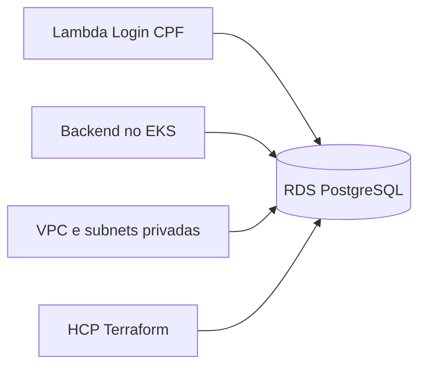

# Oficina Database Infrastructure — Fase 3

Infraestrutura como código do banco PostgreSQL gerenciado da oficina mecânica na AWS Academy.

## Responsabilidades

- Amazon RDS PostgreSQL;
- DB subnet group e security groups;
- parâmetros, armazenamento, backups e manutenção;
- outputs de conexão sem credenciais;
- estados Terraform independentes por ambiente.

As migrações Flyway e o schema funcional permanecem no repositório da aplicação.

## Arquitetura



## Tecnologias

- Terraform e HCP Terraform;
- Amazon RDS PostgreSQL 16;
- AWS Security Groups e subnets privadas;
- GitHub Actions.

## Validação

```bash
terraform fmt -check -recursive
terraform init -backend=false -input=false
terraform validate
```

O CI também executa TFLint, Trivy e Gitleaks. O plan real é manual e utiliza HCP Terraform; nenhum workflow executa apply automático.

## Documentação

- [Arquitetura](docs/architecture.md)
- [Modelo de dados e responsabilidades](docs/data-model.md)
- [AWS Academy](docs/aws-academy.md)
- [HCP Terraform e execução](docs/hcp-terraform.md)
- [Validação](docs/validation.md)
- [Repositórios da solução](docs/repositories.md)

## Contribuição

- mudanças somente por Pull Request;
- `main` representa produção;
- `homolog` representa homologação;
- plan obrigatório antes do apply;
- nenhuma senha ou arquivo de state versionado.
