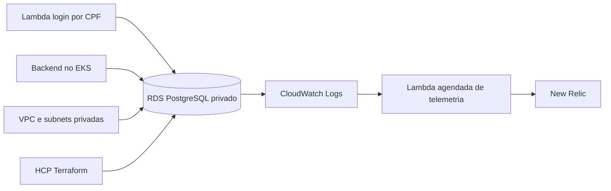

# Oficina Database Infrastructure — Fase 3

Infraestrutura como código do banco PostgreSQL gerenciado da oficina mecânica na AWS
Academy. Este repositório entrega **o serviço de banco e sua configuração**; o schema
funcional é responsabilidade das migrations Flyway do repositório da aplicação.

## Responsabilidades

- Amazon RDS PostgreSQL privado, criptografado e com SSL obrigatório;
- DB subnet group e security group restrito às origens autorizadas;
- parameter group, armazenamento, backup, manutenção e retenção;
- exportação configurável dos logs do PostgreSQL para o CloudWatch Logs;
- telemetria agregada e sanitizada do RDS para o New Relic;
- outputs de conexão sem credenciais;
- states Terraform independentes por ambiente;
- documentação do modelo de dados real e da revisão de índices.

Fora do escopo: migrations, schema, índices funcionais e qualquer recurso IAM.

## Arquitetura



Detalhes em [`docs/architecture.md`](docs/architecture.md). O modelo entidade-relacionamento
final está em [`docs/data-model.md`](docs/data-model.md), com fonte versionada em
[`docs/diagrams/er-model.mmd`](docs/diagrams/er-model.mmd).

## Tecnologias

- Terraform `>= 1.6, < 2.0` com state no HCP Terraform;
- Amazon RDS PostgreSQL 16 (`db.t3.micro`, `gp3`);
- AWS Security Groups, subnets privadas, CloudWatch Logs, Lambda e EventBridge;
- New Relic Event API para métricas e contagens sanitizadas;
- GitHub Actions com aprovação por GitHub Environment.

## Variáveis e segredos

Variáveis Terraform obrigatórias, cadastradas no workspace HCP:

| Variável | Origem | Observação |
|---|---|---|
| `vpc_id` | output do repositório de Kubernetes | |
| `private_subnet_ids` | output do repositório de Kubernetes | HCL, ao menos duas AZs |
| `allowed_security_group_ids` | `eks_cluster_security_group_id` | HCL |
| `db_password` | definida por quem opera | sensível, mínimo de 16 caracteres |

Principais variáveis opcionais (padrões completos em
[`variables.tf`](variables.tf) e exemplos em [`environments/`](environments)):

| Variável | Padrão | Efeito |
|---|---|---|
| `enabled_cloudwatch_logs_exports` | `["postgresql"]` | logs exportados; `[]` desliga |
| `manage_cloudwatch_log_groups` | `true` | cria o log group para aplicar retenção |
| `cloudwatch_logs_retention_days` | `7` | retenção do log no CloudWatch |
| `log_min_duration_statement_ms` | `1000` | limiar de consulta lenta |
| `log_statement` | `"ddl"` | escopo de SQL registrado |
| `performance_insights_enabled` | `false` | recurso pago, opcional |
| `monitoring_interval` | `0` | Enhanced Monitoring exige role IAM existente |
| `multi_az` | `false` global; `true` no perfil production | réplica síncrona em outra AZ |
| `rds_newrelic_telemetry_enabled` | `false` | cria a coleta agendada; a configuração central habilita por ambiente |
| `newrelic_account_id` / `newrelic_license_key` | `0` / vazia | credenciais da Event API mantidas no HCP Terraform |
| `backup_retention_days` | `7` | retenção do backup automático |
| `deletion_protection` | `false` global; `true` no perfil production | ver [ADR 0006](docs/adr/0006-backup-e-retencao.md) |

Segredos nunca ficam no repositório: `*.tfvars` está no `.gitignore` e o CI roda
Gitleaks.

Credenciais no workspace HCP e no GitHub Environment, renovadas a cada sessão do
Learner Lab: `AWS_ACCESS_KEY_ID`, `AWS_SECRET_ACCESS_KEY`, `AWS_SESSION_TOKEN`. No
GitHub, cada ambiente ainda usa o secret `TF_API_TOKEN` e as variables
`TF_CLOUD_ORGANIZATION`, `TF_WORKSPACE_HOMOLOG`, `TF_WORKSPACE_PRODUCTION` e
`ENABLE_TERRAFORM_APPLY`.

## Outputs necessários ao Kubernetes e à aplicação

| Output | Uso |
|---|---|
| `database_endpoint` | host do banco na configuração do backend e da Lambda |
| `database_port` | `5432` |
| `database_name` | banco inicial `oficina` |
| `jdbc_url` | URL JDBC sem usuário e sem senha |
| `database_security_group_id` | integrações de rede futuras |
| `database_log_groups` | validação de observabilidade |
| `performance_insights_enabled` | evidência de controle de custo |
| `rds_newrelic_telemetry_function_name` | Lambda que publica `OficinaRdsSample` no New Relic |

Os inputs vêm do repositório de Kubernetes (`vpc_id`, `private_subnet_ids`,
`eks_cluster_security_group_id`). Ver [`docs/repositories.md`](docs/repositories.md).

## Ambientes

| Branch | `environment` | Workspace HCP | GitHub Environment |
|---|---|---|---|
| `homolog` | `homolog` | `oficina-database-homolog` | `homolog` |
| `main` | `production` | `oficina-database-production` | `production` |

Produção usa Multi-AZ, proteção contra exclusão, snapshot final, retenção maior de backup
e de log. Performance Insights permanece opcional. Ver [`docs/cost.md`](docs/cost.md) e
[ADR 0005](docs/adr/0005-separacao-de-ambientes.md).

## Validação estática (sem custo)

```bash
terraform fmt -check -recursive
terraform init -backend=false -input=false
terraform validate
tflint --recursive
python3 scripts/validate_docs.py
```

O CI executa os mesmos passos, mais Trivy, Gitleaks, verificação dos nomes de variável
dos `*.tfvars.example` e verificação de ausência de recurso IAM. Ele apresenta quatro
jobs sequenciais: `Repository validation → Terraform validation → Database integration tests → Security validation`. O CI **não** usa credencial AWS.

## Plan, apply e destroy

Configure os workspaces conforme [`docs/hcp-terraform.md`](docs/hcp-terraform.md).

Pelo GitHub Actions:

- Pull Requests para `homolog` ou `main` executam automaticamente um plan remoto sem apply quando a infraestrutura muda;
- merges em `homolog` exibem `Validate configuration and AWS → Terraform database → Deployment summary`, executando `plan → apply → sincronização JDBC` sem aprovação manual;
- merges em `main` executam o mesmo fluxo em um único job, com uma única aprovação no GitHub Environment `production`;
- a sincronização atualiza `db_url` no workspace Auth e `APP_DB_URL`/`DEPLOY_ENABLED` no GitHub Environment do Backend;
- `workflow_dispatch` do deploy permite repetir o fluxo na branch correspondente durante bootstrap ou recuperação;
- destroy não faz parte da esteira e permanece manual via Terraform CLI.

A escrita no repositório Backend usa preferencialmente uma GitHub App instalada apenas em `oficina-backend-fiap-fase3`, com permissão **Environments: read and write**. Configure `SYNC_APP_CLIENT_ID` com o Client ID da GitHub App e `SYNC_APP_PRIVATE_KEY` com a chave privada, uma única vez nas variables/secrets do repositório Database. `GITHUB_SYNC_TOKEN` permanece disponível somente como alternativa temporária de recuperação.

Pela CLI, com o workspace configurado:

```bash
export TF_CLOUD_ORGANIZATION=<organizacao>
export TF_WORKSPACE=oficina-database-homolog

aws sts get-caller-identity   # falha aqui significa credencial expirada
terraform init -input=false -lockfile=readonly
terraform plan -input=false
terraform apply -input=false      # somente após revisar o plan
terraform destroy -input=false    # ao final da coleta de evidências
```

Pull Requests nunca executam apply. O Auto apply do HCP permanece desligado porque a
orquestração e o gate pertencem ao GitHub Environment.

## Validação dos logs

Depois do apply, valide a exportação, a retenção e o registro de conexões conforme
[`docs/observability.md`](docs/observability.md). O log é intencionalmente conservador:
`log_statement = "ddl"` e parâmetros de bind truncados, para que CPF, e-mail e telefone
não cheguem ao CloudWatch.

## Backup e exclusão

Backup automático usa retenção de 7 dias em homologação e 14 em produção, com janela
03:00-04:00 UTC. O perfil versionado de produção exige `multi_az = true`,
`deletion_protection = true`, `skip_final_snapshot = false` e snapshot final. Para uma
demonstração descartável no AWS Academy, a configuração central aceita explicitamente
`-UseAwsAcademyDisposableProductionProfile`; esse override reduz HA e deve ser removido
antes da promoção final. Racional completo no [ADR 0006](docs/adr/0006-backup-e-retencao.md).

## Estado atual

Nenhum recurso está provisionado por este repositório no momento: não há instância RDS
ativa nem endpoint válido até que um apply seja executado com credenciais válidas do
Learner Lab e as evidências sejam coletadas.

## Documentação

- [Arquitetura](docs/architecture.md)
- [Modelo de dados final](docs/data-model.md)
- [Revisão de índices e consultas](docs/index-review.md)
- [Observabilidade](docs/observability.md)
- [Custo](docs/cost.md)
- [AWS Academy](docs/aws-academy.md)
- [HCP Terraform e execução](docs/hcp-terraform.md)
- [Validação](docs/validation.md)
- [Checklist de evidências](docs/evidence-checklist.md)
- [Troubleshooting](docs/troubleshooting.md)
- [Decisões de arquitetura (ADR)](docs/adr/README.md)
- [Diagramas](docs/diagrams/README.md)
- [Repositórios da solução](docs/repositories.md)

## Contribuição

- mudanças somente por Pull Request para `homolog`;
- `main` representa produção e recebe apenas promoção a partir de `homolog`;
- plan revisado antes de qualquer apply;
- nenhuma senha, credencial ou arquivo de state versionado.
