# Modelo de dados final

## Divisão de responsabilidades

Este repositório cria e configura o serviço RDS PostgreSQL. O schema funcional
pertence ao repositório da aplicação
([oficina-backend-fiap-fase3](https://github.com/tiagomiele/oficina-backend-fiap-fase3)),
onde as migrations Flyway são a única fonte de verdade.

Este documento descreve o modelo **real**, extraído das migrations abaixo, e não um
modelo idealizado:

| Migration | Conteúdo |
|---|---|
| `V1__schema_inicial.sql` | identidade, clientes, veículos, catálogos, estoque, notas fiscais, ordens de serviço, orçamento e financeiro |
| `V2__ordens_servico_inicio_fim_execucao.sql` | `inicio_execucao` e `fim_execucao` em `ordens_servico` |
| `V3__autenticacao_cpf_e_historico_status.sql` | `documento_normalizado`, índices de autenticação por CPF e `historico_status_ordem_servico` |

O diagrama versionado fica em [`diagrams/er-model.mmd`](diagrams/er-model.mmd), com a
imagem renderizada em [`diagrams/er-model.svg`](diagrams/er-model.svg).

## Convenções

- chaves surrogate `BIGSERIAL` onde não existe chave natural;
- chaves naturais compostas em veículos, notas fiscais e itens de orçamento;
- colunas `versao`, `criado_em` e `atualizado_em` para bloqueio otimista e auditoria simples;
- exclusão lógica por `ativo` nos cadastros, sem `DELETE` físico;
- valores monetários em `NUMERIC` com escala 2;
- carimbos de tempo em `TIMESTAMPTZ`.

## Entidades

### `users`

Operadores internos da oficina. Autenticação por e-mail e senha.

- PK: `id` (`UUID`).
- UK: `email`.
- Constraints: `papel IN ('FUNCIONARIO_DA_OFICINA','TECNICO_DA_OFICINA')`.
- Índices: PK e unique de `email`.
- Sem FK para as demais entidades: a autoria das operações é registrada em log da
  aplicação, não no banco.

### `clientes`

- PK: `id_cliente` (`BIGSERIAL`).
- UK: `documento`; UK: `documento_normalizado` (`ux_clientes_documento_normalizado`).
- Colunas geradas: `documento_normalizado` é `GENERATED ALWAYS AS
  oficina_somente_digitos(documento) STORED`, o que garante unicidade independente de
  máscara.
- Constraints: `tipo_documento IN ('CPF','CNPJ')`.
- Índices: `idx_clientes_cpf_ativo` (parcial, `tipo_documento = 'CPF' AND ativo = TRUE`)
  atende o login por CPF da Lambda serverless.
- Cardinalidades: `1:N` com `veiculos` e `1:N` com `ordens_servico`.

### `veiculos`

- PK composta: (`id_placa`, `id_cliente`).
- FK: `id_cliente` → `clientes(id_cliente)`.
- Constraints: `ano BETWEEN 1900 AND 2100`.
- Índices: `idx_veiculos_cliente` (`id_cliente`).
- Cardinalidades: `N:1` com `clientes`, `1:N` com `ordens_servico`.
- A placa não é única globalmente: a unicidade é por cliente, o que permite
  transferência de propriedade sem apagar histórico.

### `servicos`

- PK: `id_servico` (`BIGSERIAL`).
- Constraints: `preco_base >= 0`.
- Índices: apenas a PK.
- Relação com `orcamentos_itens_ordem_servico` é **lógica**, pela coluna polimórfica
  `id_servico_sku` combinada com `tipo_item = 'SERVICO'`; não existe FK.

### `pecas`

- PK: `id_sku` (`BIGSERIAL`).
- Constraints: `preco_venda >= 0`.
- Índices: apenas a PK.
- Cardinalidades: `1:0..1` com `estoque_pecas`, `1:N` com
  `movimentacao_estoque_pecas` e `1:N` com `itens_nota_fiscal_fornecedor`.
- Não guarda saldo: o saldo vive em `estoque_pecas`.

### `estoque_pecas`

Saldo atual por SKU.

- PK: `id_sku`, que também é FK → `pecas(id_sku)` (identifying relationship `1:0..1`).
- Constraints: `quantidade >= 0`, o que impede saldo negativo no próprio banco.

### `movimentacao_estoque_pecas`

Histórico imutável de entradas e saídas.

- PK: `id` (`BIGSERIAL`).
- FK: `id_sku` → `pecas(id_sku)`.
- Constraints: `quantidade <> 0`;
  `origem IN ('ENTRADA_NF','ESTORNO_NF','CONSUMO_ORCAMENTO','DEVOLUCAO_ORCAMENTO')`.
- Índices: `idx_mov_estoque_sku` (`id_sku`), `idx_mov_estoque_os` (`id_ordem_servico`).
- Correlação **sem FK** com `notas_fiscais_fornecedor` (`numero_nota`, `serie_nota`,
  `cnpj_fornecedor`, `data_emissao`) e com
  `orcamentos_itens_ordem_servico` (`id_ordem_servico`, `id_orcamento`,
  `id_orcamento_item`), porque as colunas de correlação são anuláveis conforme a
  `origem` do movimento.

### `notas_fiscais_fornecedor`

- PK composta natural: (`numero_nota`, `serie_nota`, `cnpj_fornecedor`, `data_emissao`).
- Constraints: `valor_total >= 0`.
- Índices: apenas a PK composta.
- Cardinalidade: `1:N` com `itens_nota_fiscal_fornecedor` (ao menos um item por nota,
  garantido pela aplicação).
- Estorno é lógico, pela coluna `estornada`.

### `itens_nota_fiscal_fornecedor`

- PK composta: (`numero_nota`, `serie_nota`, `cnpj_fornecedor`, `data_emissao`, `id_sku`).
- FK composta → `notas_fiscais_fornecedor`; FK `id_sku` → `pecas(id_sku)`.
- Constraints: `quantidade > 0`, `preco_unitario >= 0`.
- Índices: PK composta. O prefixo da PK já serve às consultas por nota.

### `numero_os_sequencia`

Numerador mensal da Ordem de Serviço, consumido com `SELECT ... FOR UPDATE`.

- PK composta: (`mes`, `ano`).
- Constraints: `mes BETWEEN 1 AND 12`, `ano BETWEEN 2020 AND 2100`.
- Relação com `ordens_servico` é lógica: gera o identificador textual da OS.

### `ordens_servico`

- PK: `id_ordem_servico` (`VARCHAR(20)`, identificador de negócio no formato sequencial mensal).
- FK: `id_cliente` → `clientes(id_cliente)`;
  FK composta (`id_placa`, `id_cliente`) → `veiculos(id_placa, id_cliente)`.
- Constraints: `status` restrito a `RECEBIDA`, `EM_DIAGNOSTICO`,
  `AGUARDANDO_APROVACAO`, `EM_EXECUCAO`, `AGUARDANDO_PAGAMENTO`, `PAGA`, `ENTREGUE`,
  `CANCELADA`; `valor_total_conserto >= 0`; `orcamento_atual > 0`.
- Colunas de tempo de execução: `inicio_execucao` e `fim_execucao`, preenchidas uma
  única vez, alimentam o relatório de tempo médio.
- Índices: `idx_os_cliente` (`id_cliente`), `idx_os_status` (`status`).
- Cardinalidades: `N:1` com `clientes` e com `veiculos`; `1:N` com
  `orcamentos_itens_ordem_servico` e com `historico_status_ordem_servico`.

### `orcamentos_itens_ordem_servico`

Itens de orçamento com status por item e múltiplas versões de orçamento por OS.

- PK composta: (`id_ordem_servico`, `id_orcamento`, `id_orcamento_item`).
- FK: `id_ordem_servico` → `ordens_servico(id_ordem_servico)`.
- Constraints: `id_orcamento > 0`, `id_orcamento_item > 0`,
  `tipo_item IN ('SERVICO','PECA')`, `status IN ('EM_ABERTO','FINALIZADO','CANCELADO')`,
  `quantidade > 0`, `preco_unitario >= 0`.
- Índices: `idx_itens_orc_os` (`id_ordem_servico`, `id_orcamento`).
- `id_servico_sku` é referência polimórfica para `servicos(id_servico)` ou
  `pecas(id_sku)` conforme `tipo_item`; por isso não há FK.

### `historico_status_ordem_servico`

Trilha de transições de status, base do indicador de tempo por etapa.

- PK: `id` (`BIGSERIAL`).
- FK: `id_ordem_servico` → `ordens_servico(id_ordem_servico)` `ON DELETE CASCADE`.
- Constraints: mesma lista de `status` de `ordens_servico`;
  `duracao_milisegundos IS NULL OR duracao_milisegundos >= 0`.
- Índices:
  - `ux_historico_os_status_aberto`: único parcial em `id_ordem_servico` com
    `saida_em IS NULL`, garantindo no banco que só existe uma etapa aberta por OS;
  - `idx_historico_os_entrada` (`id_ordem_servico`, `entrada_em`);
  - `idx_historico_status_periodo` (`status`, `entrada_em`).
- `correlation_id` liga a transição ao rastro de log da aplicação.

### `conta_corrente_oficina`

Conta corrente unificada de contas a pagar e a receber.

- PK: `id` (`BIGSERIAL`).
- Constraints: `tipo IN ('CONTAS_A_PAGAR','CONTAS_A_RECEBER')`,
  `origem IN ('NF_FORNECEDOR','OS_PAGAMENTO')`, `valor >= 0`.
- Índices: `idx_cc_tipo` (`tipo`), `idx_cc_origem` (`origem`).
- Correlação **sem FK** com `notas_fiscais_fornecedor` e com `ordens_servico`, pelo
  mesmo motivo da movimentação de estoque: as colunas de origem são anuláveis conforme
  o tipo do lançamento.
- Estorno é lógico, pela coluna `estornado`.

## Resumo de cardinalidades

| Origem | Destino | Cardinalidade | Garantia |
|---|---|---|---|
| `clientes` | `veiculos` | 1:N | FK |
| `clientes` | `ordens_servico` | 1:N | FK |
| `veiculos` | `ordens_servico` | 1:N | FK composta |
| `ordens_servico` | `orcamentos_itens_ordem_servico` | 1:N | FK |
| `ordens_servico` | `historico_status_ordem_servico` | 1:N | FK com cascade |
| `pecas` | `estoque_pecas` | 1:0..1 | FK na PK |
| `pecas` | `movimentacao_estoque_pecas` | 1:N | FK |
| `pecas` | `itens_nota_fiscal_fornecedor` | 1:N | FK |
| `notas_fiscais_fornecedor` | `itens_nota_fiscal_fornecedor` | 1:N | FK composta |
| `notas_fiscais_fornecedor` | `movimentacao_estoque_pecas` | 1:N | aplicação |
| `notas_fiscais_fornecedor` | `conta_corrente_oficina` | 1:N | aplicação |
| `ordens_servico` | `movimentacao_estoque_pecas` | 1:N | aplicação |
| `ordens_servico` | `conta_corrente_oficina` | 1:N | aplicação |
| `servicos` / `pecas` | `orcamentos_itens_ordem_servico` | 1:N | aplicação, polimórfico |
| `numero_os_sequencia` | `ordens_servico` | 1:N | aplicação |
| `users` | `ordens_servico` | 1:N | log da aplicação |

## Dados pessoais

`clientes` concentra nome, documento, e-mail e telefone. Os parâmetros de log do RDS
neste repositório são deliberadamente conservadores para que esses valores não cheguem
ao CloudWatch: ver [`observability.md`](observability.md).

A Lambda de autenticação acessa somente `clientes` e apenas as colunas necessárias ao
login por CPF; não reutiliza as entidades JPA da aplicação.

A revisão estática de índices e consultas está em
[`index-review.md`](index-review.md).
